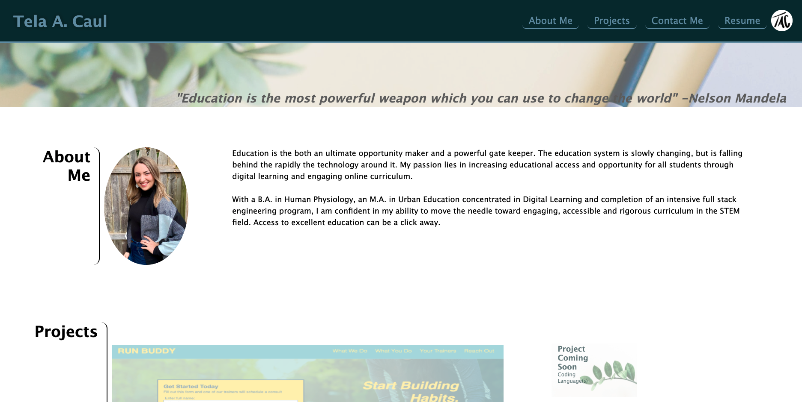

#### Welcome to My Portfolio
This portfolio is designed to be aesthetically pleasing, easy to navigate and scaffolded for addition of future projects. You will find name, recent photo, projects and contact information along with a PDF of a current resume. Each link in the navigation scrolls to the corresponding section. In the projects section, each image links to the project website or application and includes a brief description of the project name and languages used. This website is also formatted to be responsive to various screens and devices, adapting to the user viewpoint.

### Screenshot

### Navigation
* Click here to view portfolio page: https://telacaul.github.io/caul-professional-portfolio/

#### User Story
* AS AN employer
* I WANT to view a potential employee's deployed portfolio of work samples
* SO THAT I can review samples of their work and assess whether they're a good candidate for an open position

#### Acceptance Criteria
* GIVEN I need to sample a potential employee's previous work
* WHEN I load their portfolio
* THEN I am presented with the developer's name, a recent photo, and links to sections about them, their work, and how to contact them
* WHEN I click one of the links in the navigation
* THEN the UI scrolls to the corresponding section
* WHEN I click on the link to the section about their work
* THEN the UI scrolls to a section with titled images of the developer's applications
* WHEN I am presented with the developer's first application
* THEN that application's image should be larger in size than the others
* WHEN I click on the images of the applications
* THEN I am taken to that deployed application
* WHEN I resize the page or view the site on various screens and devices
* THEN I am presented with a responsive layout that adapts to my viewport

